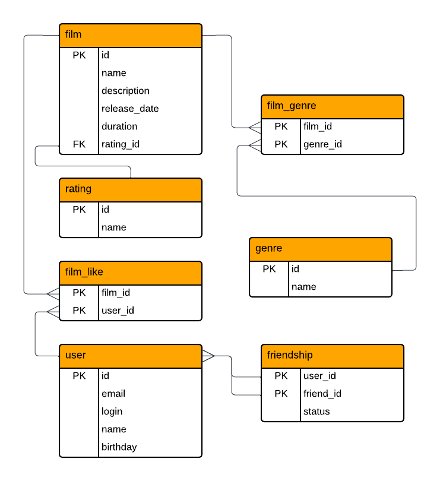

# ER-диаграмма

## ER диаграмма


---

## Описание

Схема спроектирована с учётом требований нормализации (1NF, 2NF, 3NF).
В связующих таблицах оба ключа PK образуют составной ключ.
Основные сущности — пользователи и фильмы.  
Для связей «многие-ко-многим» выделены отдельные таблицы (`film_genre`, `likes`, `friendship`).  
Возрастные рейтинги вынесены в отдельную справочную таблицу (`mpa_rating`). 

---

## Примеры SQL-запросов

### 1. Получить все фильмы
```sql
SELECT * FROM film;
```

### 2. Получить топ 5 популярных фильмов
```sql
SELECT f.name,
       COUNT(fa.user_id) likes
FROM film AS f
LEFT JOIN film_like AS fa ON f.id = fa.film_id
GROUP BY f.name
ORDER BY likes DESC
```

### 3. Найти общих друзей двух пользователей
```sql
SELECT u.id, u.name
FROM friendship f1
JOIN friendship f2 ON f1.friend_id = f2.friend_id
JOIN user u ON u.id = f1.friend_id
WHERE f1.user_id = 1 AND f2.user_id = 2
  AND f1.status = 'confirmed'
  AND f2.status = 'confirmed'
```

### 4. Получить все фильмы определённого жанра
```sql
SELECT f.id, f.name
FROM film f
JOIN film_genre fg ON f.id = fg.film_id
JOIN genre g ON fg.genre_id = g.id
WHERE g.name = 'Комедия'
```
